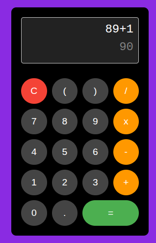

# ⚛️ Calculadora React com Math.js

Uma calculadora interativa e responsiva construída com **React**, utilizando a biblioteca **Math.js** para o processamento de expressões matemáticas e uma arquitetura de componentes reutilizáveis.

---



## 🚀 Funcionalidades

* **Cálculos Dinâmicos:** Suporte para operações aritméticas básicas (+, -, *, /).
* **Expressões Parentetizadas:** Capacidade de lidar com prioridade de operações usando parênteses.
* **Componentes Reutilizáveis:** Botões padronizados e estilizados via props (`children`, `onClick`, `className`).
* **Tratamento de Erros:** Feedback visual de "Error" para expressões matemáticas inválidas ou incompletas.
* **Interface Limpa:** Display duplo que separa a entrada (input) do resultado final.

---

## 🛠️ Tecnologias Utilizadas

* **React.js** (Hooks como `useState`)
* **Math.js** (Motor de avaliação de expressões matemáticas)
* **CSS3** (Estilização com Flexbox e Grid para o teclado numérico)

---

## 📦 Instalação e Configuração

Siga os passos abaixo para rodar o projeto localmente:

1. **Clone o repositório:**
   ```bash
   git clone https://github.com/zumpchiat/calculator.git
    ```
2. **Entre na pasta do projeto**
    ```bash
   cd calculator
3. **Instale as dependências:**
    ```bash
    npm install

4. **Inicie o servidor de desenvolvimento:**

    ```bash
    npm start

O projeto abrirá automaticamente em http://localhost:3000

---

## 📁 Estrutura de Pastas

src/
├── components/
│   └── Button/
│       ├── Button.js      # Componente de botão funcional
│       └── Button.css     # Estilos específicos do botão
├── App.js                 # Lógica principal, estados e renderização
├── App.css                # Layout da calculadora e do display
└── index.js               # Ponto de entrada do React

---

## ⚠️ Notas sobre Manutenção (npm audit)

Este projeto foi desenvolvido com foco em segurança. Caso o comando npm audit aponte vulnerabilidades 
em dependências profundas (como underscore ou nth-check dentro do mathjs ou react-scripts), 
recomenda-se o uso de overrides no package.json em vez de npm audit fix --force, 
para evitar a quebra das scripts de build do React.

---

## 📖 Como Usar

Digitação: Clique nos botões para montar sua expressão.

Operações: Use os operadores e parênteses para cálculos complexos, ex: (10 + 5) * 2.

Resultado: Clique em = para acionar a função evaluate do Math.js.

Limpar: Use o botão C para resetar todos os estados da calculadora.